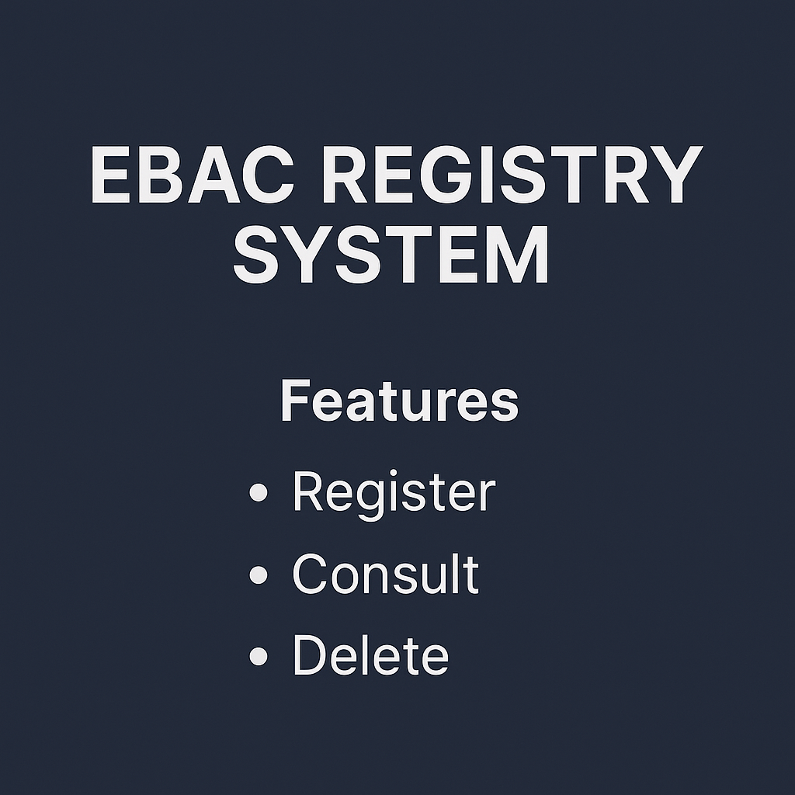

# EBAC Registry System

A simple user management system in C that allows registering, consulting, and deleting records based on CPF (Brazilian personal ID number). Developed as an introductory project to file handling, string manipulation, and menus in C.

---

##  Features

- **Register User**
  - CPF
  - First Name
  - Last Name
  - Job Title
  - Data saved in `.txt` files (named after the CPF)

- **Consult User**
  - Displays the user's information based on the entered CPF

- **Delete User**
  - Removes the file associated with the entered CPF

---

##  How It Works

The system uses text files to store user data. Each record is saved in a file named `<CPF>.txt`, and the content is structured in a single comma-separated line.

### File Structure

CPF,FIRSTNAME,LASTNAME,JOBTITLE

## How to Run

1. Compile the code using a C compiler, for example:

gcc RegistrySystem.cpp -o ebac_registry

2. Run the program

./ebac_registry

## Requirements

C compiler compatible with C99 or later

Windows-based system for system("cls") and system("pause") support

## Author
 Bruno Brehmer Massaneiro
 # Developed as part of a C programming course project at EBAC.
